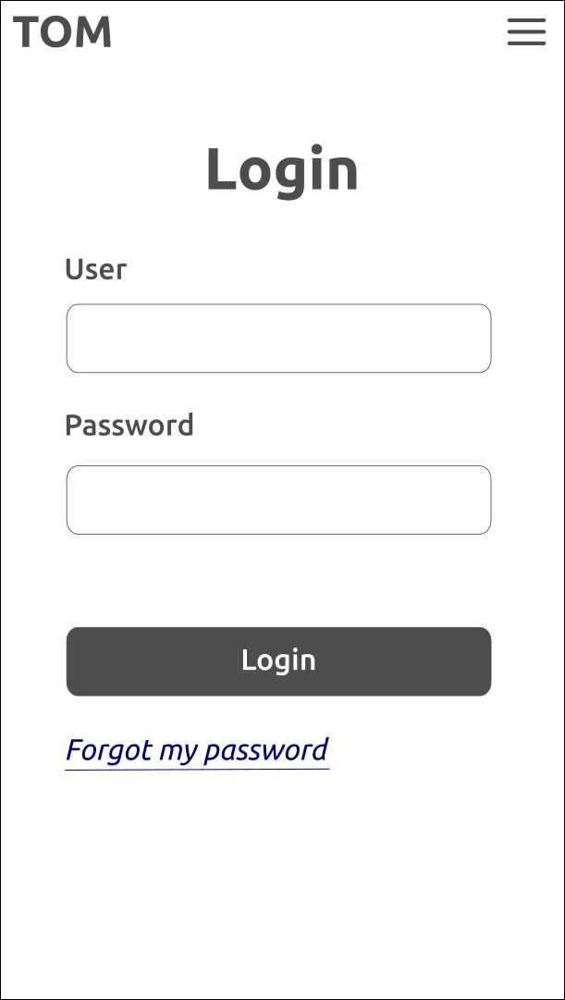

# Change Log

## Sprint 1

_May 20th 2024 to May 31st 2024_

### TOM login component

Login component: The user authentication method into the TOM application. This will involve the profile, person, user entities and front-end views.

- [x] Schema table for the authentication
- [x] Schema table for the authorization?
- [ ] User entities
- [ ] Session JWT
- [ ] Landing view
  - 
- [ ] Login view
  - 

## Domain schema

_May 16th 2024_: At the moment we are working with the domain entities.
